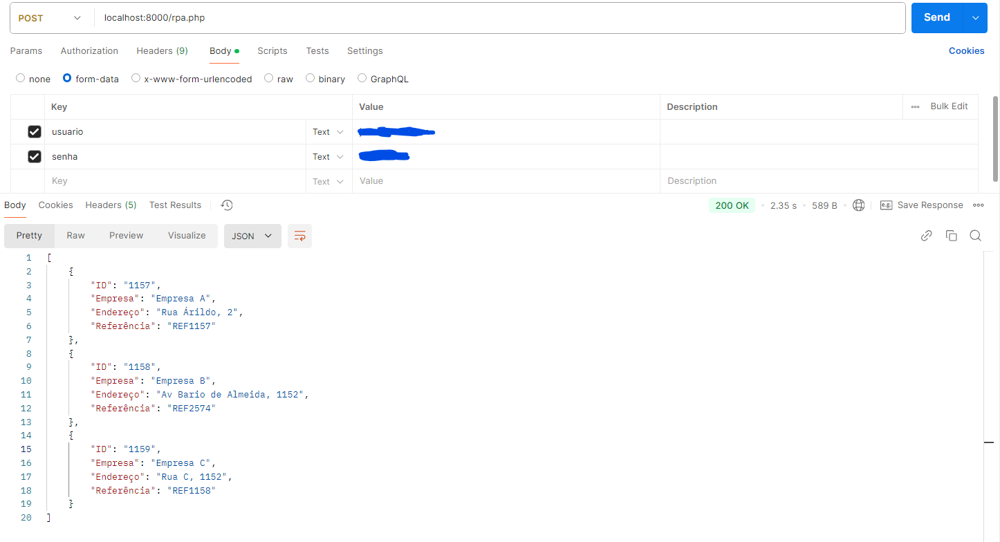

# Teste para empresa (confidencial)

Este é um teste para desenvolver um RPA em **PHP puro** que acessa o sistema [7 Vitrines](https://sistema.7vitrines.com/login), realiza login e retorna os dados da tabela presente em [https://sistema.7vitrines.com/teste](https://sistema.7vitrines.com/teste) no formato **JSON**.


## **Como executar**

> **Pré-requisitos:**  
> Certifique-se de que o PHP esteja instalado em sua máquina. Se não estiver, faça o download em [php.net](https://www.php.net/).


1- Realize o clone do repositório
```sh
git clone https://github.com/JoaoVitor2310/teste-RPA-PHP
```
2- Entre no diretório
```sh
cd teste-RPA-PHP
```
3- Inicie o servidor embutido do php
```sh
php -S localhost:8000
```
4- Execute a requisição POST, eviando "usuario" e "senha" no form-data para o seguinte URL
```sh
localhost:8000/rpa.php
```

Exemplo:


## Como funciona

1- **Acessa a página de login:** Uma requisição cURL é enviada para https://sistema.7vitrines.com/login para obter o HTML inicial.

2- **Verifica o estado de autenticação:** Analisa o HTML retornado para determinar se o usuário já está logado, verificando a presença de elementos específicos, como o botão "Sair".

3- **Realiza o login (se necessário):** Caso não esteja logado, o script realiza uma requisição POST utilizando cURL, enviando as credenciais (usuario, senha) e o token CSRF extraído do HTML.

4- **Acessa a página da tabela:** Após a autenticação, uma requisição cURL é enviada para https://sistema.7vitrines.com/teste para obter os dados da tabela.

5- **Extrai os dados da tabela:** Os dados são extraídos utilizando DOMDocument e XPath, processados para gerar um array com as informações.

6- **Retorna o JSON:** O array com os dados da tabela é convertido para o formato JSON e retornado como resposta.